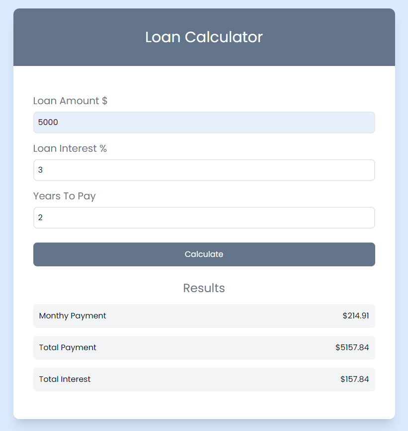

# Loan Calculator Project Intro

This is another project that I created to get a better understanding of the DOM and how to manipulate it. This project is a loan calculator that will calculate the monthly payment, total payment, and total interest based on the loan amount, interest rate, and the number of years to pay off the loan.

## Project Specifications

- Build the UI using Tailwind CSS
- Create a form to take in the loan amount, interest rate, and number of years to pay off the loan
- Calculate the monthly payment, total payment, and total interest
- Show a spinner for 1 second and then display the results
- Show a custom error alert box if there is an error

## Creating The UI

We will start from scratch and create the UI using the Tailwind CSS framework. We won't have to write any custom CSS because Tailwind has very low-level classes for just about any style that you can think of. You can skip the HTML/CSS part if you want and just focus on the JavaScript.

## The Calculation

You do not have to understand the math behind the calculation. I do not fully understand it myself. I just did some research to get the formula that we needed. Here are some links that I mention in the video that you can check out if you want to learn more about the math behind the calculation.

- [Kasasa Website Article](https://www.kasasa.com/blog/how-to-calculate-loan-payments-in-3-easy-steps)
- [Loan Calculator Formula](https://www.thecalculatorsite.com/articles/finance/loan-calculator-formula.php)
- [Java GitHub Example](https://gist.github.com/letrongtanbs/d29354da30f12784bc8453af4e4fb6ff)
