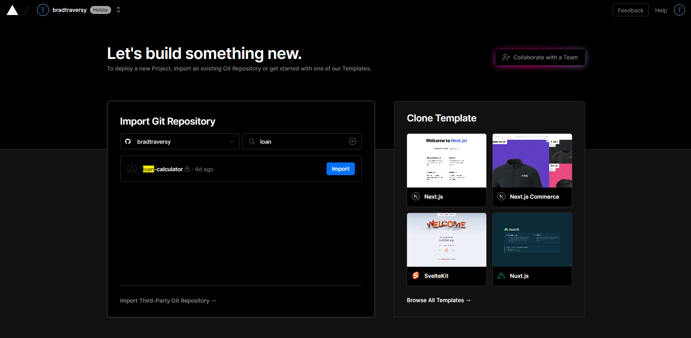

# Vercel Deploy

Vercel is another incredible hosting service with a very generous free tier. It's also very easy to deploy to Vercel. It is almost an identical process to what we did with Netlify in the last section. You simply select the GitHub repo.

## Push to GitHub

First, we need to push our project to GitHub. If you haven't already, create a new repository on GitHub and push your project to it. We went over how to do this back in the Shopping List project.

## Log In to Vercel

You can log in to Vercel using your GitHub account.

Once you log in, click "Add new" and select "project" from the dropdown.

Simply search for your repo on GitHub and select it.

After a few seconds, your project will be deployed and you will see the URL to access it.

Just do a quick test to make sure everything is working.

You can continue to make changes to your project and push them to GitHub. Vercel will automatically deploy the changes.

You also have the option to connect your project to a custom domain. You can do this by clicking on the "Domains" tab and then clicking "Add Domain".
